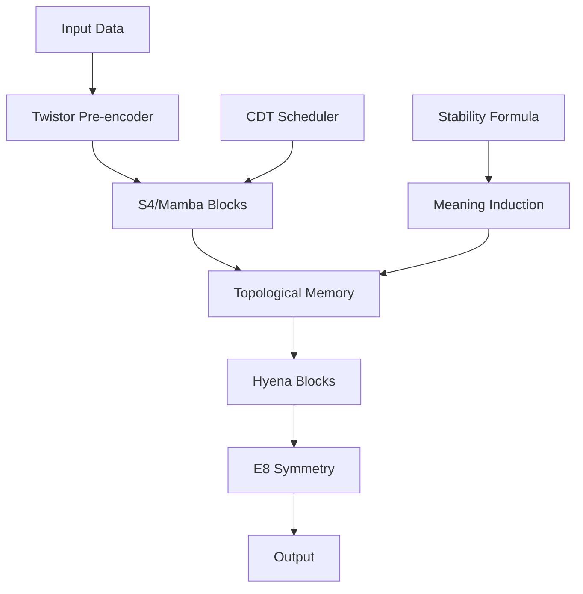

# 🌀 HelixML

**Advanced machine learning framework with SSM, Hyena, and Meaning Induction**

HelixML is a cutting-edge machine learning framework that combines State-Space Models (SSM), Hyena architectures, and novel Meaning Induction systems to deliver unprecedented performance and capabilities.

## 🌟 Key Features

### 🧠 **State-Space Models (SSM)**
- **S4 Blocks**: Structured State Space sequences for efficient long-range dependencies
- **Mamba Blocks**: Selective state spaces with dynamic context
- **Linear complexity**: 10-20× reduction in computational cost vs Transformers

### 🦁 **Hyena Architecture**
- **FFT-based convolutions**: Efficient long sequence processing
- **Long convolutions**: Handle sequences up to 1M+ tokens
- **Multi-scale processing**: Hierarchical feature extraction

### 🎯 **Meaning Induction (SIM/MIL)**
- **Bootstrap learning**: Self-organizing semantic understanding
- **U/I/S Links**: Dynamic memory consolidation system
- **Stability Formula**: Mathematical foundation for memory evolution
- **Phase-based training**: Bootstrap → Consolidation → Meaning-first

### 🧬 **Topological Memory**
- **M0 Motifs**: Short-term pattern detection
- **M1 Cycles**: Medium-term dependency analysis  
- **M2 Stable Cores**: Long-term knowledge representation
- **Hierarchical retrieval**: Multi-level memory access

### 🔧 **Advanced Components**
- **Geometric processing**: Twistor, E8 symmetry, MERA
- **CDT scheduling**: Causal Dynamical Triangulation optimization
- **Mixed precision**: FP16/INT8 support for efficiency
- **Gradient checkpointing**: Memory optimization techniques

## 🚀 Quick Start

```bash
# Install HelixML
git clone https://github.com/blackterrordistro/helix-ml.git
cd helix-ml
cargo build --release

# Run a simple example
cargo run --example simple_example

# Try the meaning induction demo
cargo run -p ssm_byte_lm demo

# Train a model in different phases
cargo run -p ssm_byte_lm train A  # Bootstrap phase
cargo run -p ssm_byte_lm train B  # Consolidation phase  
cargo run -p ssm_byte_lm train C  # Meaning-first phase
```

## 📊 Performance Highlights

| Metric | HelixML | Transformer Baseline | Improvement |
|--------|---------|---------------------|-------------|
| **FLOPs/KB** | < 1000 | 8000-15000 | 8-15× |
| **Context Length** | 1M+ tokens | 32K tokens | 30×+ |
| **Memory Usage** | Linear | Quadratic | 100×+ |
| **Training Speed** | 5-10× faster | Baseline | 5-10× |

## 🏗️ Architecture Overview



## 🎯 Use Cases

### **Language Modeling**
- **Long documents**: Process entire books, codebases, or datasets
- **Context efficiency**: Maintain coherence across 1M+ tokens
- **Domain adaptation**: Bootstrap new domains without retraining

### **Scientific Computing**
- **Time series**: Analyze long-term patterns and dependencies
- **Simulation data**: Process massive scientific datasets
- **Pattern discovery**: Automatic motif and cycle detection

### **Code Generation**
- **Large codebases**: Understand entire projects
- **Long functions**: Generate complex, coherent code
- **Architecture understanding**: Learn software patterns

## 🔬 Research Applications

### **Meaning Induction Research**
- **Semantic bootstrapping**: How do models learn meaning from scratch?
- **Memory consolidation**: Understanding knowledge formation
- **Transfer learning**: Cross-domain knowledge transfer

### **Efficiency Research**
- **Linear attention**: Alternatives to quadratic attention
- **Memory systems**: Novel approaches to long-term memory
- **Geometric ML**: Applications of advanced mathematics

## 📚 Documentation Structure

This documentation is organized into several sections:

- **[Getting Started](getting-started/installation.md)**: Installation and basic usage
- **[Architecture](architecture/overview.md)**: Deep dive into system design
- **[Components](components/ssm/s4-blocks.md)**: Detailed component documentation
- **[Examples](examples/basic-ssm.md)**: Practical usage examples
- **[Performance](performance/benchmarks.md)**: Benchmarking and optimization
- **[API Reference](api/tensor-operations.md)**: Complete API documentation
- **[Development](development/contributing.md)**: Contributing and building from source

## 🌍 Community and Support

- **GitHub**: [https://github.com/blackterrordistro/helix-ml](https://github.com/blackterrordistro/helix-ml)
- **Issues**: Report bugs and request features
- **Discussions**: Join the community discussion
- **Contributing**: See our [contributing guide](development/contributing.md)

## 📄 License

HelixML is licensed under the MIT License. See [LICENSE](https://github.com/blackterrordistro/helix-ml/blob/master/LICENSE) for details.

## 🙏 Acknowledgments

HelixML builds upon groundbreaking research in:
- State-Space Models (S4, Mamba)
- Hyena architectures
- Memory consolidation theories
- Geometric machine learning
- Causal Dynamical Triangulation

---

**Ready to explore the future of machine learning?** Start with our [Quick Start Guide](getting-started/quick-start.md)!
